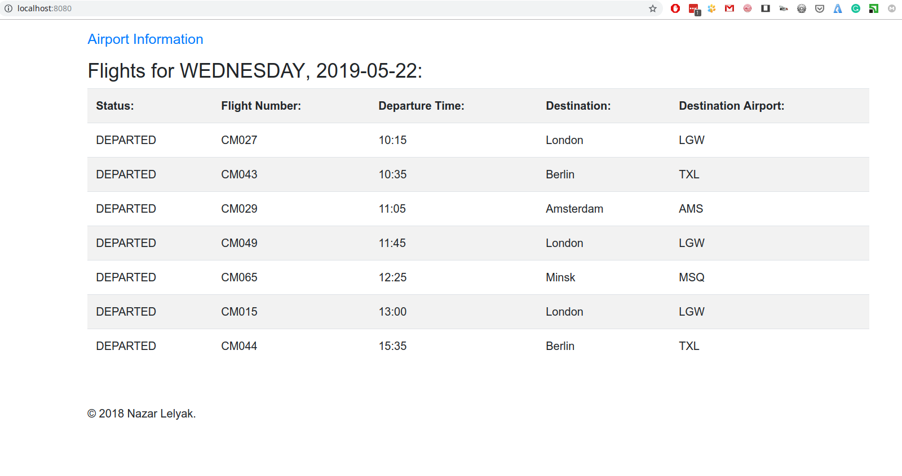

#### Requirements:

You need to have `Java 8` installed on your workstation for launching the application.

If you want to use your IDE you need to add support of Lombok to it.
For IntelliJ Idea -> install `Lombok plugin` and activate `Enable annotation processing` in project Settings after importing.

#### For launching application, you have few options:

 - from console:
    
    gradle bootRun
    
 - from IDE:
 
    run class `net.lelyak.FlightParserAppApplication` 
    
You will see in console that application started:

    net.lelyak.FlightParserAppApplication    : Started FlightParserAppApplication in ... seconds
    
You can access following URL in a browser:

    http://localhost:8080/  
    
You have to see something like following:

      